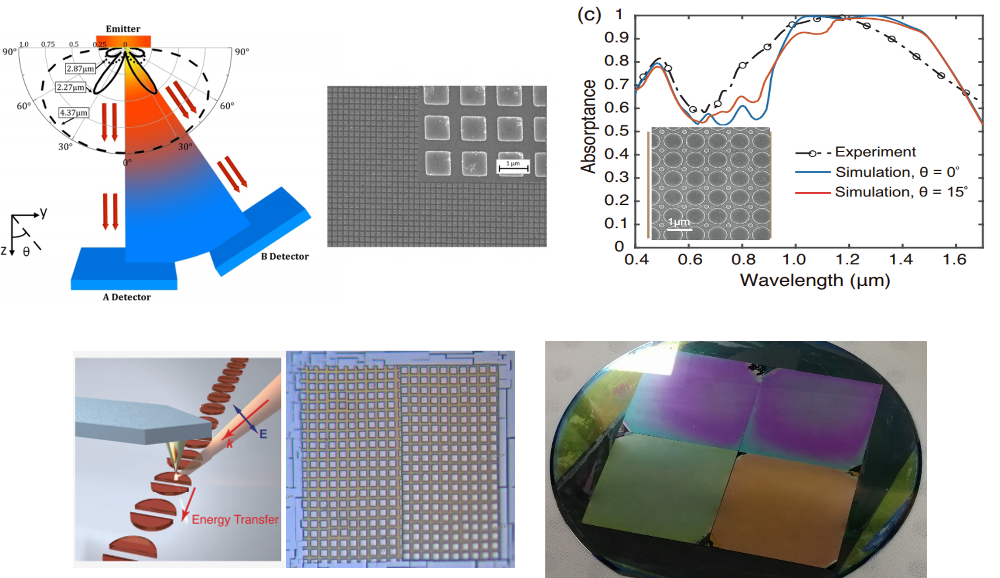

We are interested in the theory of light (thermal radiation)-matter interactions in nanostructures and cold atoms, especially the rich physics regarding non-Hermitian, topological, disorder and quantum effects. On this basis, we conduct far- and near-field experiments on nanoscale light-matter interactions. By tailoring these nanoscale interactions, we work towards applications, aiming at efficient energy transport/conversion, high resolution imaging and information processing.

Our research consists of the following topics with selected publications: [[View by year](https://wangboxiang-sjtu.github.io/publications/)] [[Google scholar](https://scholar.google.com/citations?user=5KgNBgUAAAAJ)]
(To be updated)
